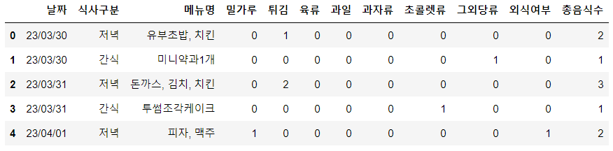
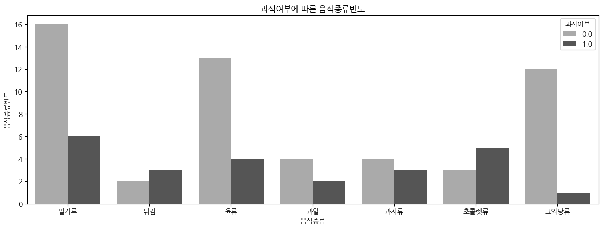

# 역류성 식도염의 원인은 뭘까?

## 프로젝트 선정 이유

2021년 12월 15일을 시작으로 2022년 1월까지 심하게 체한 듯한 증상이 지속되어서 병원을 자주 방문했습니다. 증세로는 **팔다리 저림과 차가워짐, 명치의 답답함과 통증, 두통, 고열, 구토, 뒷목과 등의 통증, 목에 이물감** 등입니다.

2022년 1월 병원 방문을 이후로 죽을 주식으로 삼다가 2022년 3월 다시 증상이 심하게 발생하여 결국 위내시경과 지방산검사를 받습니다. 처방을 받고 식습관 조절로 역류성 식도염에서 해방되나 했습니다.

2023년 2월 말부터 증상이 다시 발생하였습니다. 데이터 분석 공부를 마친 지금, **나의 역류성 식도염에는 어떤 요인이 원인이 될까 분석**해보고자 합니다.

## 역류성 식도염의 원인을 일으키는 요인들

(식도염을 치료받고 있는 병원 문서 참고)

스트레스, 흡연, 음주, 과식, 초콜렛, 지방질, 명치와 허리 부분을 죄는 옷 등 다양한 생활 습관이 요인이 됩니다.

- (2022년 3월~ 2023년 2월 28일 재발병) 전후 생활 습관 비교

| 이전 | 이후 |
| --- | --- |
| 규칙적인 수면(1시 취침~7시50분 기상) | 불규칙적인 수면 |
| 간식을 거의 먹지 않음 | 매끼니마다 간식을 먹음 |

따라서, 아래의 경우를 원인으로 추정하고, **다음 중 제일 큰 요인이 되는 것을 찾아보고자** 합니다.

- 식사 습관 - 과식, 밀가루, 기름진 음식, 간식(초콜렛 등)
- 생활 습관 - 불규칙한 수면 습관

# 진행 단계

- 23/03/30 데이터셋 수집 시작
- 23/04/12 생활습관, 음식 데이터셋 분리 / 칼럼 수정
    - 동일 날짜 내, 점심, 저녁, 간식 컬럼에 메뉴를 입력 ⇒ 식사구분 컬럼에 아침, 점심, 저녁, 간식을 기록할 수 있도록 변경
    - 음식 데이터셋에는 음식 종류 구분과 총음식수 컬럼 추가

- 23/04/24 1차 분석

# 데이터셋 설명

23/03/30~23/04/21 기간 동안 수집 된 데이터

## 생활습관 데이터

- 증상의 단계 구분
    
    
    | 속불편한정도 |
    | --- |
    | 1~3 : 배부름의 정도 |
    | 4  : 속이 불편함 |
    | 5 : 명치가 불편함 |
    | 6 : 열 동반 |
    | 7 : 열, 두통 |
    | 8 : 손발 저림, 차가워짐(혈액순환) |
    | 9 : 목 이물감, 등과 목의 구타 당한듯한 아픔 |
    | 10 : 구토감, 7~9의 복합증세 |

## 음식 데이터

- 음식 종류 구분 : 전체 음식 종류를 구분하지 않고, 증상에 영향을 미치는 것으로 보이는 음식의 종류들만 기록함.
- 문제 상황(23/04/24) : 총음식수의 부정확한 기록으로 ‘과식여부’ 컬럼과의 상관성을 알아보지 못함.

# 시각화

생활습관 데이터(indigestion) 내에서 나쁜 습관으로 추정되는 것은 다음과 같다.

- 수면 : 불규칙
- 과식 : 증상이 3 이상일 때, 과식이 차지하는 건수 (6/12건) / 증상이 4 이상일 때, 과식이 차지하는 건수 (5/8건)
- 간식 : 간식 섭취 (21/23건)

## (생활습관) 수면

평균 총 수면시간 (6.652174), 최소(1), 최대(10)으로 시각화를 보아도 균일하지 못한 수면시간을 알 수 있다.

## (생활습관) 간식

식사보다 많은 간식 횟수

## 그렇다면, 생활습관 데이터 내에서 증상에 가장 큰 영향을 미치는 변수는 무엇인가?

상관관계를 그려보면, 증상과 상관점수가 높은 변수는 과식여부(0.59)이다.

## (음식) 과식일 때 음식 종류

(과식 = 1, 과식이 아닐 때 = 0)

과식일 때, 초콜렛을 많이 먹음.

## (음식) 증상에 영향을 많이 미치는 음식 변수

- 속이 불편할 때는 고기 섭취가 불가능해서, 육류와 증상과의 상관관계가 높을 줄 알았으나, 그렇지 않음
- 증상과 의미 있는 관계가 있어 보이는 음식 종류는 아직 없음
    - 데이터셋이 좀 더 축적되면 달라질 것으로 예상
    - **과식이 증상과 연관이 높기 때문에, ‘총음식수’도 당연히 연관이 있어야 했으나, 데이터 수집 단계에서 음식수를 누락한 부분이 많기 때문에 정확하게 반영이 되지 않았음.**

# 초기 가설

- 가설1. 증상 발생 시간은 새벽 시간대이다.
    - 데이터 수집 기간 동안 극심한 증상이 발생하지 않아 분석 보류
    - 증상 발생 시간을 기록하는 컬럼 부재
- 가설2. 음식의 종류보다 양이 소화 불량에 더 많은 영향을 미친다.
    - 음식 개수와 소화 불량의 상관관계 ⇒ 상관관계 낮음(데이터 수집 오류)
    - 과식과 소화 불량의 상관관계 ⇒ 상관관계가 높음
- (종류보다 먹은 시간대가 영향을 미친다.)
    - 먹은 시간대 기록 컬럼 부재
- (간식의 종류가 영향이 있을까?)
    - 아직까지는 음식의 종류가 미치는 영향은 작아보임

# 1차 결론

- 데이터 수집을 하며, 병원에서 말하는 역류성 식도염의 원인을 일으키는 요인 중 다수를 일상 생활 속에서 행하고 있음을 발견
    - 운동, 규칙적인 수면, 간식 절제 등을 실행한 후 A/B테스트를 비교해보고 싶다.
- 나의 식도염 증상을 유발하는 요인은 ‘과식’의 영향이 크다.

# 기타

## 어려운 점

1. 데이터셋 수집
    1. 음식 분류에 관한 도메인 지식이 부족해, 식품 분류 항목을 어떻게 선정해야 할 지 고민. ex) 육류, 당류, 간편식, 가공식, 간식, 패스트푸드, 길거리 음식 등

## 자료

- 학습 자료
    - 위식도역류질환 환자의 식이 위험요인 및 삶의 질 [https://academic.naver.com/article.naver?doc_id=37364213](https://academic.naver.com/article.naver?doc_id=37364213)
    - 역류성 식도염 환자의 건강증진행위에 미치는 영향요인 [https://academic.naver.com/article.naver?doc_id=862783271](https://academic.naver.com/article.naver?doc_id=862783271)